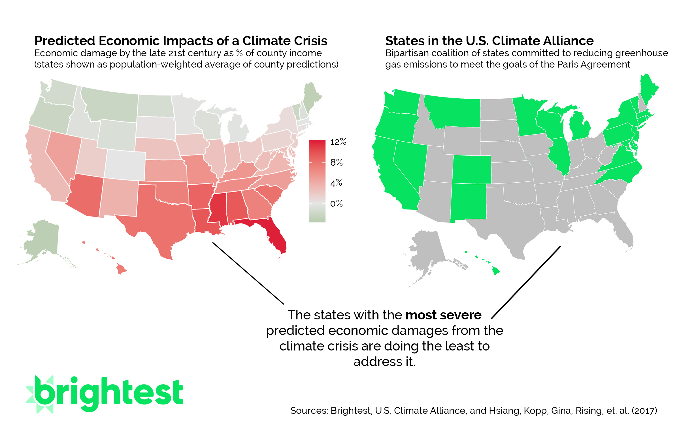
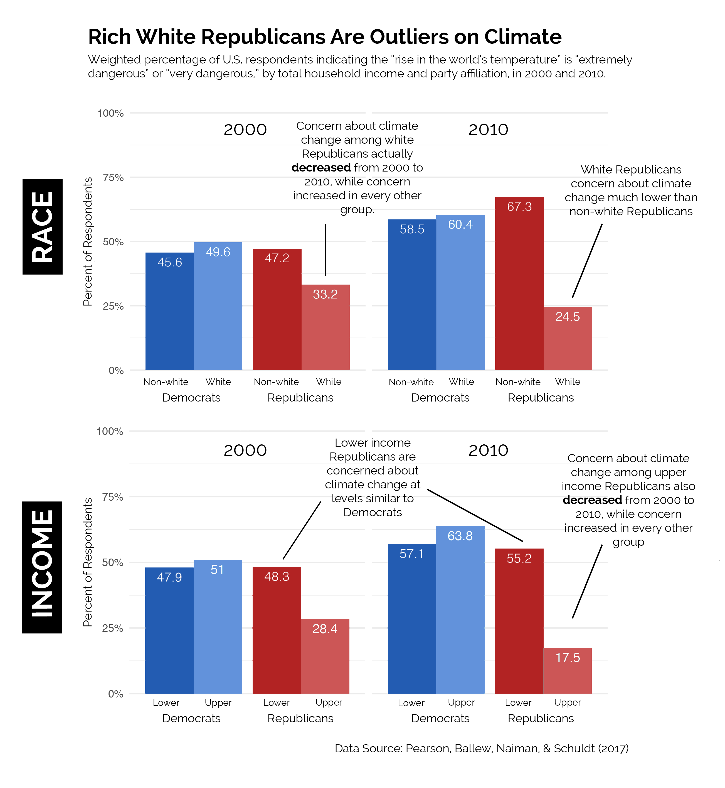

# DataforClimate

> Ben Franklin said "There are **three kinds of people**: those that are _immovable_, those that are _movable_, and _those who move_." Activists on [Brightest](https://www.brightest.io/) are **those who move**, how do we help them find the people who are **movable**? This piece will use opinion, impact, and political engagement data to inform strategy recommendations for climate activists, identifying core consituencies and demographic trends in support and opposition to understand what races and political offices could be influenced most by activism on climate change and climate justice. 

# Stories
## Story: [The Missing Votes on Climate](https://www.brightest.io/climate-change-voter-data)

## Story: [The Untapped (Republican) Climate Voters](https://www.brightest.io/climate-republican-class-latinx-voter-data)

